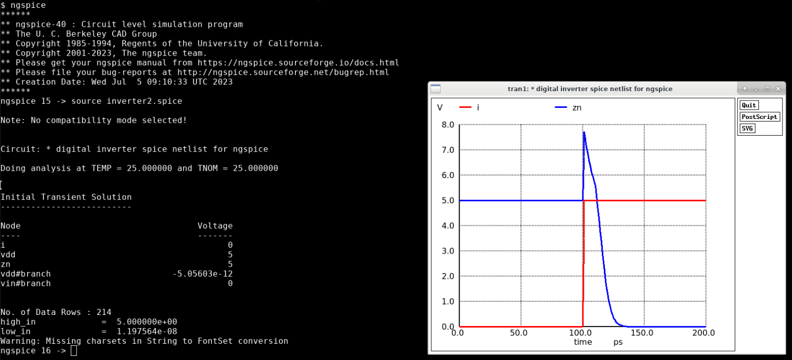

## Tutorial
[TOC]

### Using OpenLane to run a Digital Inverter targeting the gf180 technology.
The file `digital-inverter-openlane-gf180mcu.ipynb` is a digital inverter example with OpenLane flow targeting the gf180 based on google Colab. You can checkout the file for more details.


### Using Xschem and Ngspice to draw and simulate a Digital Inverter

#### Install tools
##### Install Xschem

###### Troubleshooting
1. when I execute 'xschem' command in centos 7, it prints 'xschem: error while loading shared libraries: libtk8.6.so: cannot open shared object file: No such file or directory', how can I fix it? 
> Step 1. Install tk by 'sudo yum install -y tk tcl tk-devel tcl-devel'
> Step 2. Add '/usr/local/lib' into the tail of the file '/etc/ld.so.conf'
> Step 3. Update the system's dynamic linker run-time bindings by 'sudo ldconfig'
> Step 4. Run xschem again


##### Install Ngspice
1. Pre-install the tools by executing `sudo yum install -y libXaw-devel libXmu-devel libXext-devel libXft-devel libX11-devel readline-devel` 

2. Install ngspice
- Step 1: Download the latest software package from the [website](https://ngspice.sourceforge.io/download.html)
- Step 2: Then the install flow can be followed by the folllowing commands:
```bash
$ tar -zxvf ngspice-40.tar.gz
$ mkdir release
$ cd release
$ ../configure --with-x --enable-xspice --disable-debug --enable-cider --with-readline=yes --enable-openmp CFLAGS="-m64 -O2 -std=c99"
$ make 2>&1 | tee make.log
$ sudo make install
$ ngspice --verison
```

### Design a Digital Inverter spice netlist

#### Run the simulation on Ngspice
1. Get the Spice Model File from [github](https://github.com/google/globalfoundries-pdk-libs-gf180mcu_fd_pr/blob/main/models/ngspice/sm141064.ngspice). You may need two files, namely `design.ngspice` and `sm141064.ngspice`.
2. Write a Digital Inverter spice netlist, such as `inverter.spice`.
```
* Digital Inverter Spice Netlist for ngspice

* Sources
Vin I 0 dc pulse(0 5 100p 1p 1p 100p 200p)
Vdd VDD 0 dc 5

* Main circuit
X1 I ZN VDD VDD 0 0 gf180mcu_fd_sc_mcu7t5v0__inv_1

* Temperature set
.temp 25
.options tnom=25

* Analyses
.control
tran 1p 200p
meas tran high_in FIND V(ZN) AT=100p
meas tran low_in  FIND V(ZN) AT=200p

wrdata inv_simulated.csv {high_in} {low_in}

.endc

* Libraries calling
.include "design.ngspice"
.lib "sm141064.ngspice" typical

.SUBCKT gf180mcu_fd_sc_mcu7t5v0__inv_1 I ZN VDD VNW VPW VSS
xM_i_0 ZN I VSS VPW nmos_6p0 W=8.2e-07 L=6e-07
xM_i_1 ZN I VDD VNW pmos_6p0 W=1.22e-06 L=5e-07
.ENDS


.end
```

3. Now run ngspice to simulate
> To simulate the provided Spice netlist using ngspice, follow these steps:

> Step 1: Create a text file and save it with a .spice extension (e.g., inverter.spice). Copy and paste the entire Spice netlist into this file.

> Step 2: Open a terminal or command prompt and navigate to the directory where the inverter.spice file is located.

> Step 3: Enter ngspice in the terminal and press Enter to launch ngspice. This will open the ngspice command prompt.

> Step 4: At the ngspice command prompt, type source inverter.spice and press Enter to load the inverter.spice netlist file.

> Step 5: Ngspice will read the netlist, initialize the circuit elements, and prompt you with the ngspice command prompt again.

> Step 6: To run the simulation, type run at the ngspice command prompt and press Enter.

> Step 7: Ngspice will perform the transient analysis for the specified time range (from 1 picosecond to 200 picoseconds in this example) and measure the voltage values at specific time points (100 picoseconds and 200 picoseconds).

> Step 8: After the simulation, ngspice will write the measured voltage values to a CSV file named inv_simulated.csv in the current working directory.

> Step 9: To exit ngspice, type quit at the ngspice command prompt and press Enter.

> You can then examine the generated inv_simulated.csv file to analyze the simulation results.



### Design a digital inverter using Xschem and simulate it using Ngspice
You can watch [this video](https://www.youtube.com/watch?v=USCmZuREMTE&list=PLZuGFJzpFksCU7yKn2P_xRTOktVBDWAJf&index=2) for references.
#### Set variable environment for PDK
add the following lines into the `.bashrc` or `.zshrc`
> export PDK_ROOT=~/pdk
> export PDK=gf180
#### Use `volare` to manage **gf180mcu** technology, here is the [repo](https://github.com/efabless/volare)
#### Create soft link to the PDK
#### Modify `xschemrc` so that it can find the pdk and ngspice
#### Create new tests and symbols directories
#### Run `Xschem` and draw the inverter 
#### Save the curcuit into a symbol
#### Draw a new `tb` file to simulate the inverter by Ngspice

